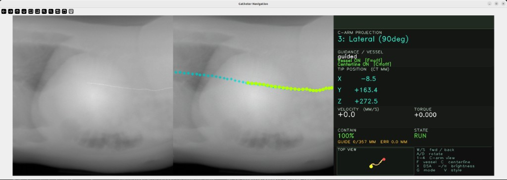
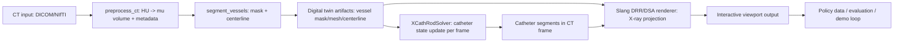

# Endoluminal Workflow



---

## Overview

The Endoluminal Workflow provides a GPU-accelerated simulation environment for training and deploying autonomous endovascular catheter and guidewire navigation systems. It combines a physics-accurate fluoroscopy (X-ray) renderer with an XPBD rod physics solver and a patient vasculature digital twin, forming a complete data factory for reinforcement learning and imitation learning policies.

The workflow is designed for interventional cardiology researchers, medical device manufacturers, and AI policy developers working on tasks such as TAVR (Transcatheter Aortic Valve Replacement) guidance, coronary intervention, and endovascular navigation.

---

## Table of Contents

- [Overview](#overview)
- [System Architecture](#system-architecture)
- [Key Components](#key-components)
- [Directory Structure](#directory-structure)
- [Requirements](#requirements)
- [Quick Start](#quick-start)
- [Execution Paths (Host vs Docker)](#execution-paths-host-vs-docker)
- [How to run](#how-to-run)
  - [Via agentic skills](#via-agentic-skills)
  - [Via the i4h CLI](#via-the-i4h-cli)
  - [Directly with `python -m`](#directly-with-python--m)
  - [Interactive viewport controls](#controls)
- [Troubleshooting](#troubleshooting)

---

## System Architecture

The workflow is organized as a unified simulation loop that couples imaging and device physics over the same patient digital twin:



At runtime, user controls update the catheter state in `XCathRodSolver`, then the renderer composites catheter attenuation into DRR/DSA in the same frame.

---

## Key Components

### Fluoroscopy Simulator (`fluorosim`)

GPU-accelerated Digitally Reconstructed Radiograph (DRR) renderer implemented in [Slang](https://github.com/shader-slang/slang):

- **Beer-Lambert catheter compositing** — fused ray march that correctly composites catheter attenuation with the CT background in a single GPU dispatch
- **Batched multi-environment rendering** — single-dispatch rendering for N parallel RL environments via `Texture2DArray`
- **DSA pipeline** — Digital Subtraction Angiography with independent noise, Compton scatter, and sub-pixel misregistration
- **Detector realism** — gain/bias, Poisson noise, Gaussian noise, PSF blur, gamma correction
- **Differentiable rendering** — Slang autodiff for gradient-based pose estimation

### Physics Solver (`catheter-vasculature-solver`)

XPBD Cosserat rod solver for real-time catheter and guidewire simulation:

- `XPBDRodSolver` — batched multi-rod GPU solver with CUDA graph capture
- `XCathRodSolver` — extends `XPBDRodSolver` with vessel-mesh containment (SDF/BVH + AABB/edge broadphase) and track-guided insertion
- `NewtonXPBDRodSolver` — Newton-XPBD hybrid solver

### Vasculature Digital Twin (`vasculature-digital-twin`)

Patient-specific vessel reconstruction from CT:

- CT ingestion (DICOM/NIfTI), HU thresholding, TotalSegmentator segmentation
- VTK marching cubes meshing, Windowed Sinc smoothing
- VMTK / Dijkstra centerline extraction
- Warp BVH mesh for GPU collision queries

### Decoupled CatheterProvider Interface

The `FluoroSimulator` is decoupled from the physics solver via the `CatheterProvider` protocol.
Any solver (or custom data source) can be attached without modifying the renderer:

```python
from fluorosim import FluoroSimulator
from fluorosim.catheter_provider import SolverCatheterAdapter
from fluorosim.catheter import XCathRodSolver

solver = XCathRodSolver(...)  # see fluorosim/examples for full construction
provider = SolverCatheterAdapter(solver, radii=0.5, mu_values=1.5, scale=1000.0)

sim = FluoroSimulator(volume, config, catheter_provider=provider)

for pose in trajectory:
    solver.step(dt)
    frame = sim.render_frame(pose=pose)   # catheter fetched automatically
```

---

## Directory Structure

```text
catheter_navigation/
├── scripts/
│   └── simulation/
│       └── fluorosim/          # Core fluoroscopy + physics simulator package
│           ├── catheter/       # XPBD rod solvers (XPBDRodSolver, XCathRodSolver)
│           ├── rendering/      # Slang DRR renderer + DSA pipeline
│           ├── catheter_provider.py  # Decoupled CatheterProvider protocol + adapters
│           ├── simulator.py    # FluoroSimulator high-level API
│           ├── preprocessor.py # CT volume preprocessing
│           └── vasculature.py  # Vessel mesh + centerline extraction
├── tests/
└── docker/
```

---

## Requirements

### GPU

- **NVIDIA GPU** with CUDA Compute Capability ≥ 7.0 (Volta or later); Ampere (≥ 8.0) or newer recommended.
- **VRAM**: ≥ 8 GB for single-environment interactive use; ≥ 16 GB recommended for batched multi-environment rendering / data generation.
- Vulkan-capable driver (required by the Slang DRR renderer).

### Driver & System

- **CPU architecture**: x86_64
- **Operating system**: Ubuntu 22.04 or 24.04 LTS
- **NVIDIA driver**: compatible with CUDA 12.8 (typically ≥ 570)
- **CUDA toolkit**: 12.8 (matches the workflow Docker image)
- **System RAM**: ≥ 16 GB (≥ 32 GB recommended for CT volume preprocessing + segmentation)
- **Storage**: ≥ 20 GB free (workflow plus one CT subject; the TotalSegmentator small subset alone is ~3.2 GB)

### Tested Configuration

This workflow has been tested on the following configuration:

- **GPU**: NVIDIA RTX A6000 (48 GB VRAM)
- **NVIDIA driver**: 570.211.01
- **CUDA**: 12.8
- **OS**: Ubuntu 22.04.5 LTS (kernel 6.8.0)
- **CPU architecture**: x86_64
- **System RAM**: 125 GB

---

## Quick Start

Everything runs through the repo's `./i4h` CLI from the repository root. List the
available modes:

```bash
./i4h modes catheter_navigation
```

Then launch the interactive fluoroscopy viewport against a preprocessed CT cache
(one-liner):

```bash
./i4h run catheter_navigation interactive_viewport --local --run-args="--ct-dir /tmp/ct_cache --vessel-source real --insertion-axis centerline --dsa"
```

See [How to run](#how-to-run) for downloading a CT dataset and building the
`/tmp/ct_cache` (preprocess → segment) that the command above expects.

---

## Execution Paths (Host vs Docker)

The same workflow can be run either on host Python (`--local`) or in Docker (default when `--local` is omitted):

- **Host / local (`--local`)**: uses your active host Python environment. In this mode, skills may create/use a local `.venv` and install dependencies there.
- **Docker (recommended for reproducibility)**: drop `--local` to run via the workflow containerized path that matches documented CUDA/runtime expectations. The image installs three reusable packages during build: public `fluorosim` (from `i4h-sensor-simulation`), plus vendored `vasculature-digital-twin` and `catheter-vasculature-solver`.

Examples:

```bash
# Host/local path (uses host Python environment)
./i4h run catheter_navigation render_drr --local --run-args="--output /tmp/drr.png"

# Docker path (recommended for consistent setup across machines)
./i4h run catheter_navigation render_drr --run-args="--output /tmp/drr.png"
```

---

## How to run

> **No data or digital twin is shipped.** No CT scans, attenuation volumes,
> vessel masks, meshes, or centerlines are committed. You generate the
> vasculature digital twin locally from a CT volume you supply
> (`preprocess_ct` → `segment_vessels`). Bring your own data (e.g. the public
> TotalSegmentator dataset below) and comply with that dataset's license.

This workflow registers with the repo's `./i4h` CLI, so each stage can be run
either through the CLI or directly with `python -m`.

### Via agentic skills

In addition to direct CLI usage, this workflow supports the agentic skill path under `skills/i4h-catheter-navigation*`.

- Start with `skills/i4h-catheter-navigation/` as the router skill.
- Then run stage skills for setup, digital twin generation, DRR render, viewport, smoke, or e2e.
- Use this path when you want an agent to execute the workflow step-by-step from natural language prompts instead of manually issuing all commands.

Typical skill sequence:

1. `i4h-catheter-navigation-setup`
2. `i4h-catheter-navigation-digital-twin`
3. `i4h-catheter-navigation-render-drr` and/or `i4h-catheter-navigation-viewport`
4. `i4h-catheter-navigation-smoke` or `i4h-catheter-navigation-e2e`

Example natural-language prompts to run in an agent chat:

```text
Run the catheter setup skill and verify prerequisites for this repo.

Build the digital twin for a subject (for example `s0065`) from `/path/to/cttotalsegmentator/s0065` into `/tmp/ct_cache`.

Render one DRR frame from `/tmp/ct_cache` and save it to `/tmp/catheter_drr_from_skill.png`.

Launch the interactive catheter viewport using `/tmp/ct_cache` with vessel-source `real`, centerline insertion, det-size `1024`, pixel-spacing `0.6`, DSA enabled, and key-hold-ttl `0.20`.

Run the catheter smoke skill and summarize pass/fail.

Run the catheter e2e skill and summarize completed vs skipped stages.
```

Expected artifacts after the skill flow:

- Digital twin cache at `/tmp/ct_cache` with `mu_volume.npy`, `metadata.json`, and centerline/vessel outputs.
- DRR frame at `/tmp/catheter_drr_from_skill.png`.
- Smoke test summary (`OK`) and e2e stage summary in the agent response.

### Via the i4h CLI

> **Run these from the repository root** (where the `./i4h` script lives), **not**
> from `workflows/catheter_navigation/`. `--local` runs on the host; drop it to
> run in Docker. Extra arguments are forwarded with `--run-args="…"`.
> The first Docker-backed run may trigger an image build that can take up to
> ~10 minutes.

```bash
cd /path/to/i4h-workflows          # repo root containing ./i4h
./i4h modes catheter_navigation        # list available modes
./i4h run catheter_navigation preprocess_ct --local \
  --run-args="--nifti /path/to/ct.nii.gz --output-dir /tmp/ct_cache --save-hu"
./i4h run catheter_navigation segment_vessels --local \
  --run-args="--ct-dir /tmp/ct_cache --ts-gt-dir /path/to/segmentations"
./i4h run catheter_navigation interactive_viewport --local \
  --run-args="--ct-dir /tmp/ct_cache --vessel-source real --insertion-axis centerline --det-size 1024 --pixel-spacing-mm 0.6 --dsa"
```

`segment_vessels` uses two different paths:

- `--ts-gt-dir`: **input** TotalSegmentator labels (e.g. `$SUBJ/segmentations`)
- `--ct-dir`: **output cache** location where generated digital-twin artifacts are written/read (e.g. `/tmp/ct_cache`)

`interactive_viewport` must always point `--ct-dir` to that generated cache output path.

Docker equivalents using mounted workspace data paths:

```bash
cd /path/to/i4h-workflows          # repo root containing ./i4h
./i4h run catheter_navigation preprocess_ct \
  --run-args="--nifti /workspace/i4h/data/ct_data/s0011/ct.nii.gz --output-dir /workspace/i4h/data/ct_cache/s0011 --save-hu"
./i4h run catheter_navigation segment_vessels \
  --run-args="--ct-dir /workspace/i4h/data/ct_cache/s0011 --ts-gt-dir /workspace/i4h/data/ct_data/s0011/segmentations"
./i4h run catheter_navigation interactive_viewport \
  --run-args="--ct-dir /workspace/i4h/data/ct_cache/s0011 --vessel-source real --insertion-axis centerline --det-size 1024 --pixel-spacing-mm 0.6 --dsa"
```

### Directly with `python -m`

Install local dependencies from the pinned requirements file (same environment
used by `./i4h ... --local`):

```bash
REPO_ROOT=/path/to/i4h-workflows
python3 -m venv "${REPO_ROOT}/.venv-cath"
source "${REPO_ROOT}/.venv-cath/bin/activate"
python -m pip install --upgrade pip setuptools wheel
python -m pip install -r "${REPO_ROOT}/workflows/catheter_navigation/requirements.txt"
```

Then run workflow commands. Viewport/render entry scripts live in this repo and import the installed packages:

```bash
cd workflows/catheter_navigation
```

### 1. Download a CT dataset (TotalSegmentator)

Contrast-enhanced CTA subjects work best for vessel navigation. The dataset is
published as a single zip, so download the small **102-subject subset (~3.2 GB)**
and extract one subject. Zenodo's direct download is heavily throttled, so prefer
the authors' Dropbox mirror:

```bash
# Recommended: Dropbox mirror (full speed). Downloads into the current directory.
curl -L "https://www.dropbox.com/scl/fi/pee5yxebfxrhz007cbuy5/Totalsegmentator_dataset_small_v201.zip?rlkey=osvfk02jc4lw5gr6uhrldtb9e&dl=1" \
  -o Totalsegmentator_dataset_small_v201.zip
unzip Totalsegmentator_dataset_small_v201.zip -d Totalsegmentator_dataset_small_v201

# Fallback: Zenodo (throttled). Small subset is record 10047263; full set is 10047292.
# pip install zenodo_get && zenodo_get 10047263

ls Totalsegmentator_dataset_small_v201   # list subjects, pick one
```

### 2. Build the digital twin from a subject

The patient digital twin generation stage is reused from the `i4h-sensor-simulation`
ecosystem via the packaged `vasculature-digital-twin` module (invoked below with
`python -m vasculature_digital_twin.cli.*`), while this workflow composes those
outputs with catheter solver and interactive viewport modes.

```bash
SUBJ=/path/to/Totalsegmentator_dataset_small_v201/s0011   # any extracted subject
CACHE=/tmp/ct_cache

# CT → attenuation volume (mu_volume.npy + metadata.json); keep HU for masking
python -m vasculature_digital_twin.cli.preprocess_ct --nifti "$SUBJ/ct.nii.gz" --output-dir "$CACHE" --save-hu

# Segment the arterial tree → vessel_mask + centerline (this IS the digital twin)
# NOTE:
#   - "$SUBJ/segmentations" is input labels only.
#   - "$CACHE" is where generated digital-twin outputs are written.
python -m vasculature_digital_twin.cli.segment_vessels --ct-dir "$CACHE" --ts-gt-dir "$SUBJ/segmentations"
```

### 3. Interactive viewport

```bash
python scripts/simulation/fluorosim/examples/interactive_catheter_slang_viewport.py \
  --ct-dir /tmp/ct_cache \
  --vessel-source real --insertion-axis centerline \
  --det-size 1024 --pixel-spacing-mm 0.6 --dsa
```

#### Controls

| Input | Action |
|---|---|
| **W / S** (or ↑ / ↓) | Advance / retract the catheter along the centerline |
| **A / D** (or ← / →) | Rotate catheter CCW / CW |
| **Shift** | Boost command magnitude |
| **F** | Toggle vessel overlay |
| **C** | Toggle centerline overlay |
| **X** | Toggle the DSA contrast bolus on / off |
| **− / =** | DSA brightness: darker / brighter |
| **V** | Toggle visual style (cinematic / default) |
| **1 / 2 / 3 / 4** | C-arm projection: AP / LAO-45 / Lateral / RAO-30 |
| **Space** | Pause / resume |
| **R** | Reset catheter to initial state |
| **Q / Esc** | Quit |
| Mouse left-drag | Horizontal = insertion/retraction velocity; vertical = torque |

---

## Troubleshooting

### Remote / headless displays: viewport controls appear dead

On some Linux X11 setups (VNC, Chrome Remote Desktop, virtual `:N` displays)
OpenCV's Qt build auto-selects a platform plugin that never delivers key events,
so the interactive viewport's controls appear dead. The viewport forces the
`xcb` plugin automatically; if input still doesn't register, launch with the
plugin set explicitly — via the `./i4h` CLI:

```bash
QT_QPA_PLATFORM=xcb ./i4h run catheter_navigation interactive_viewport --local --run-args="--ct-dir /tmp/ct_cache --vessel-source real --insertion-axis centerline --dsa"
```

or directly with `python -m`:

```bash
QT_QPA_PLATFORM=xcb python scripts/simulation/fluorosim/examples/interactive_catheter_slang_viewport.py …
```

Many remote window managers also use *focus-follows-mouse*: keep the mouse
pointer over the fluoro image while pressing keys, or the input is routed
elsewhere.

### CMake cache mismatch after switching Docker/local

If you see errors like:

- `CMakeCache.txt directory ... is different than ... /workspace/i4h/...`
- `The source ... does not match the source ... used to generate cache`

you are reusing a build cache generated by a different path context (Docker vs host).
Clear the workflow build directory and rerun:

```bash
cd /path/to/i4h-workflows
rm -rf build/catheter_navigation
```
